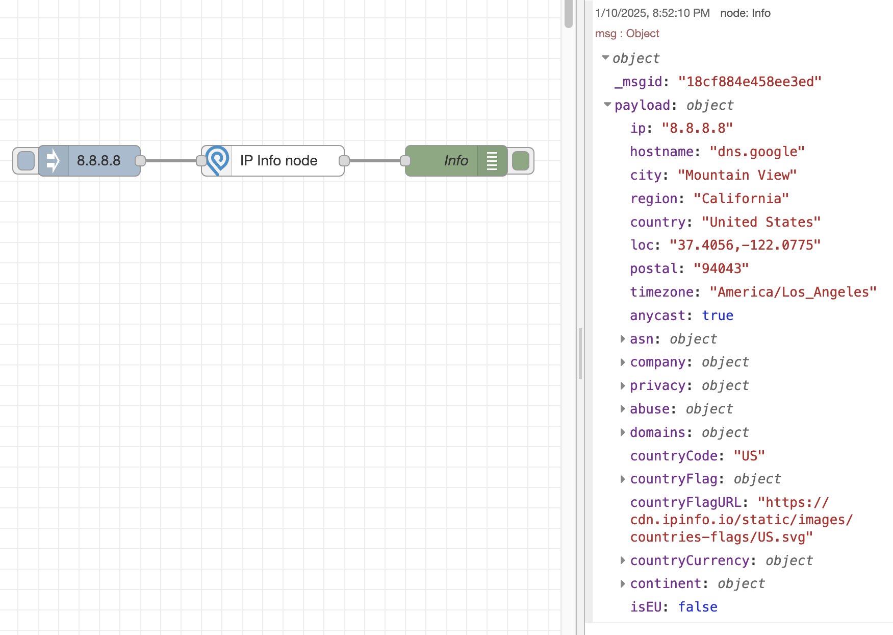

# IP Info - Node Red 

 [](https://www.npmjs.com/package/@gautric/node-red-ipinfo) 
 
 [](https://www.npmjs.com/package/@gautric/node-red-ipinfo) 

<a href="https://www.buymeacoffee.com/gautric" target="_blank"></a>

## Installation

```sh
# Using npm
npm install --save @gautric/node-red-ipinfo

# Using yarn
yarn add @gautric/node-red-ipinfo
```

## Example



## How to contribute
Have an idea? Found a bug? See [how to contribute][contributing].
